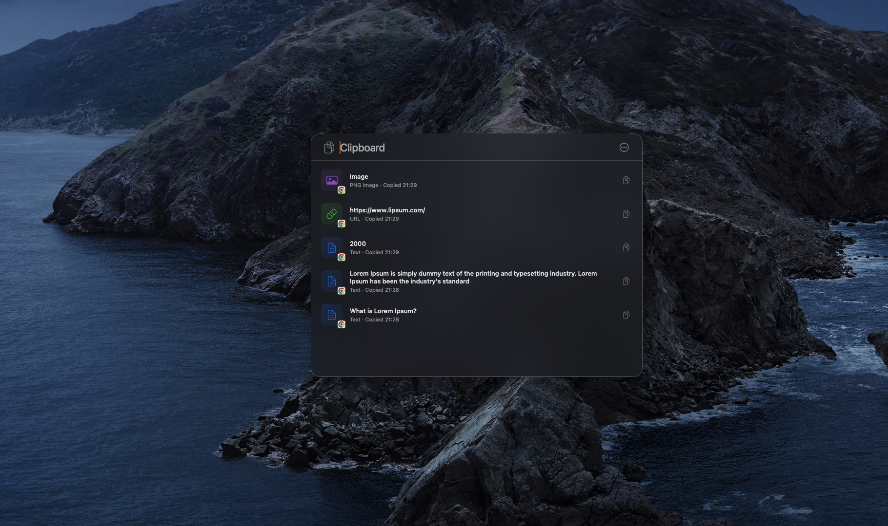
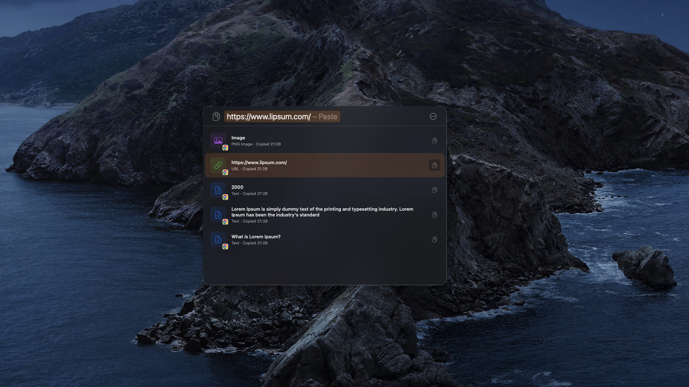
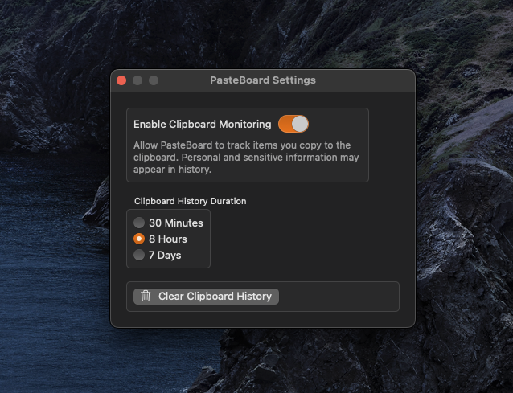
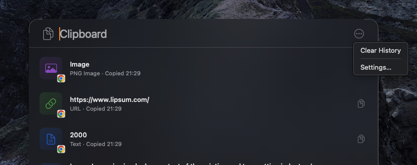

# PasteBoard

[](https://github.com/yusufgltc/PasteBoard/releases/latest)
[](https://github.com/yusufgltc/PasteBoard/releases)
[](https://github.com/yusufgltc/PasteBoard/stargazers)
[](https://github.com/yusufgltc/PasteBoard)
[](LICENSE)

macOS 26 Tahoe introduced a native clipboard history — but only for Macs that can run it.
If your MacBook doesn't support the upgrade, you lose that feature entirely.

PasteBoard brings the same experience to older Macs: it silently records everything you copy and lets you get it back instantly with **⌘⇧V**.



---

## Features

- **Clipboard history** — keeps the last 50 items you copied: text, URLs, images, and files
- **Instant search** — start typing to filter your history as you type
- **Keyboard navigation** — Tab through your history, hit Return to paste
- **Source app badges** — each item shows which app it came from
- **Configurable retention** — keep history for 30 minutes, 8 hours, or 7 days
- **Lightweight** — native SwiftUI app, no subscription, no Electron

---

## Install

### Homebrew (recommended)

> **What is a Homebrew Cask?**
> Homebrew is a package manager for macOS. A *cask* is Homebrew's way of installing GUI apps — it automates the
> "download DMG → open → drag to Applications" process into a single command. Once installed, you can also update
> or uninstall PasteBoard using `brew upgrade pasteboard` and `brew uninstall pasteboard`.

```bash
brew install --cask yusufgltc/pasteboard/pasteboard
```

### Manual

1. Download `PasteBoard-1.0.0.zip` from the [latest release](https://github.com/yusufgltc/PasteBoard/releases/latest)
2. Open the DMG and drag **PasteBoard.app** to your Applications folder
3. Launch PasteBoard from Applications or Spotlight

> **First launch note** — macOS may show a security warning because the app was downloaded from the internet.
> Open **System Settings → Privacy & Security** and click **Open Anyway**.

---

## Usage

| Action | Shortcut |
|--------|----------|
| Open PasteBoard | **⌘⇧V** |
| Navigate down the list | **↓** |
| Select item / return to search bar | **Tab** |
| Paste selected item | **Return** |
| Dismiss | **Escape** |

Press **Tab** on any item to load it into the search bar — you can see it ready to paste before committing.



---

## Advanced

### Ignore Copied Items

To prevent sensitive content from being recorded, disable monitoring before you copy:

1. Click the **···** button in the top-right corner and open **Settings**
2. Toggle **Enable Clipboard Monitoring** off, copy your sensitive content, then toggle it back on



Apps that use Secure Input (password managers, Terminal sudo prompts) are automatically excluded by macOS.

### Clear History

Click the **···** button and choose **Clear History** to wipe everything at once.



### Speed up Clipboard Check Interval

PasteBoard checks for new clipboard content every **0.5 seconds**. This reads only a single integer from the system — the pasteboard's `changeCount` — so battery impact is negligible. If you need faster detection, edit `PasteboardMonitor.swift`:

```swift
timer = Timer(timeInterval: 0.5, repeats: true) { [weak self] _ in
    self?.check()
}
```

---

## License

PasteBoard is released under the [MIT License](LICENSE).
